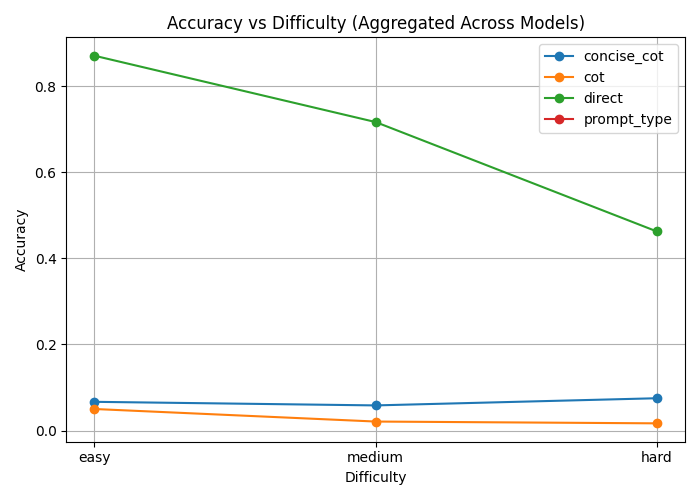
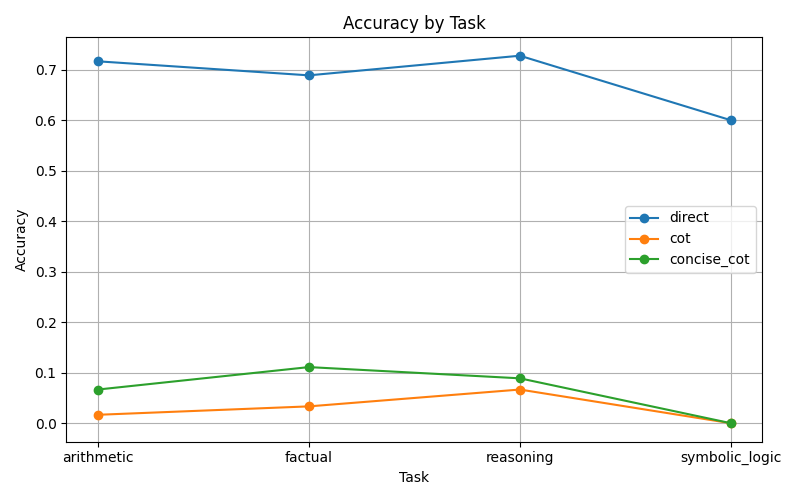

<<<<<<< HEAD
# COT-HURTS-PERFORMANCE
=======
# When Chain-of-Thought Breaks Evaluation

This repository accompanies the paper:

> **When Chain-of-Thought Breaks Evaluation: Measuring the Fragility of Reasoning Prompts Under Automated Answer Extraction**

## 🔍 Summary

Chain-of-Thought (CoT) prompting is widely believed to improve reasoning in large language models.  
This work shows that under common **automated evaluation pipelines**, CoT prompting can lead to **severe measured accuracy degradation**, even when underlying reasoning may be correct.

The core issue is a mismatch between **verbose reasoning outputs** and **simple answer extraction heuristics**.

## 📊 Key Findings

- Direct prompting outperforms CoT under exact-match evaluation
- Measured accuracy drops of **58–73 percentage points** under CoT
- Larger models do not mitigate this issue
- Many CoT failures arise from answer extraction, not reasoning errors

## 🧪 Experimental Setup

- Models: LLaMA 8B, 17B, 70B variants
- Tasks: Arithmetic, factual QA, reasoning, symbolic logic
- Prompts: Direct, CoT, concise CoT
- Evaluation: Automated exact-match scoring

## 📈 Results




## 🔬 Reproducibility

```bash
python run_experiment.py
python evaluate_results.py
```
## 📄 Paper

- arXiv: <link once live>

## ⚠️ Takeaway

- Prompting strategy and evaluation design must be treated as a joint system.
>>>>>>> acd130d (Update README and paper to reflect findings on Chain-of-Thought prompting; remove outdated result files)
